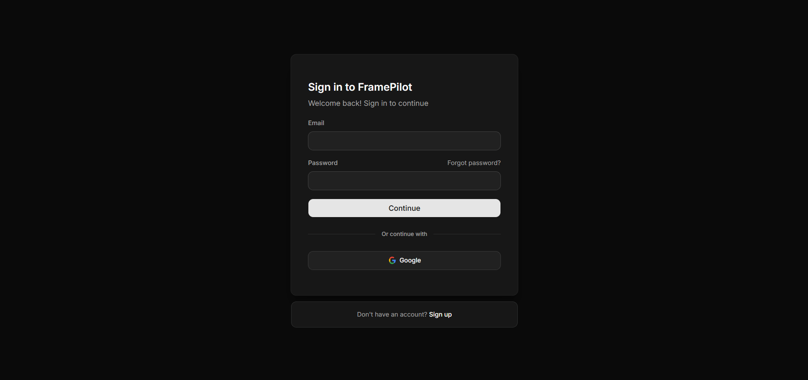
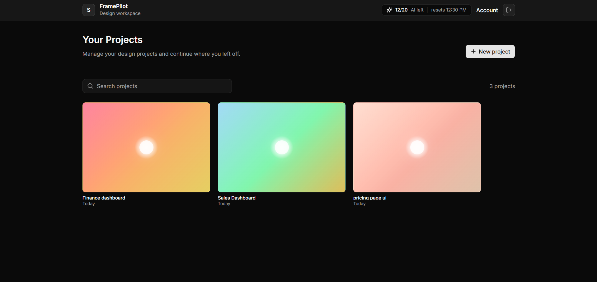
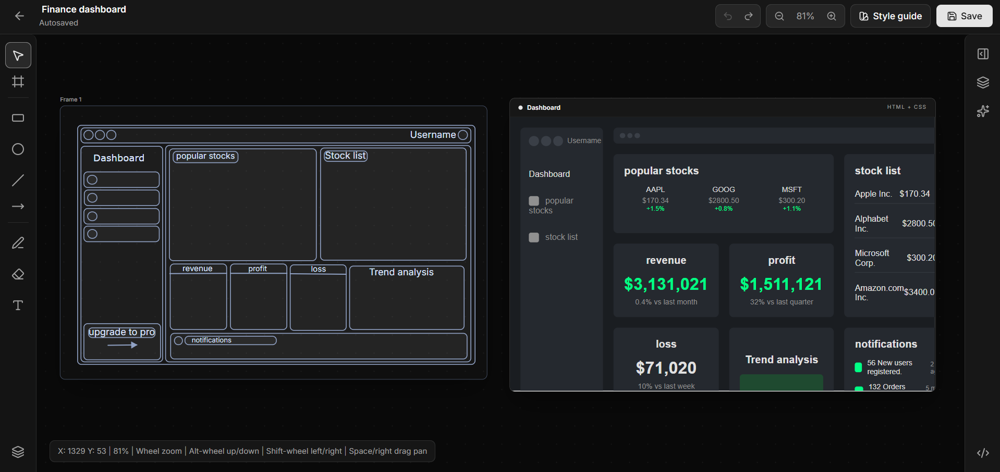
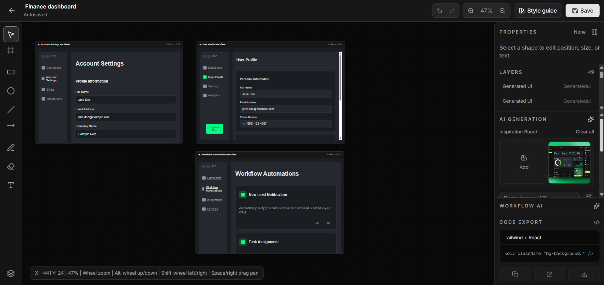
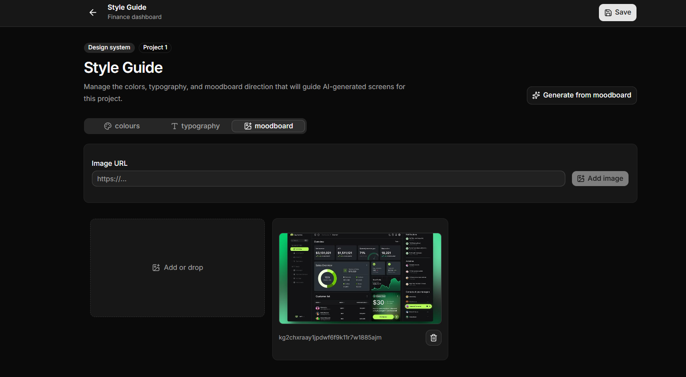
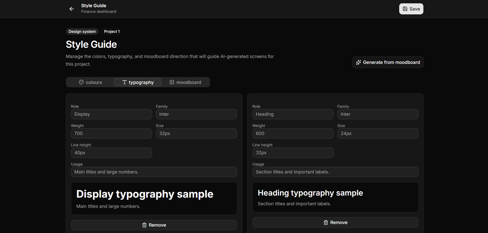
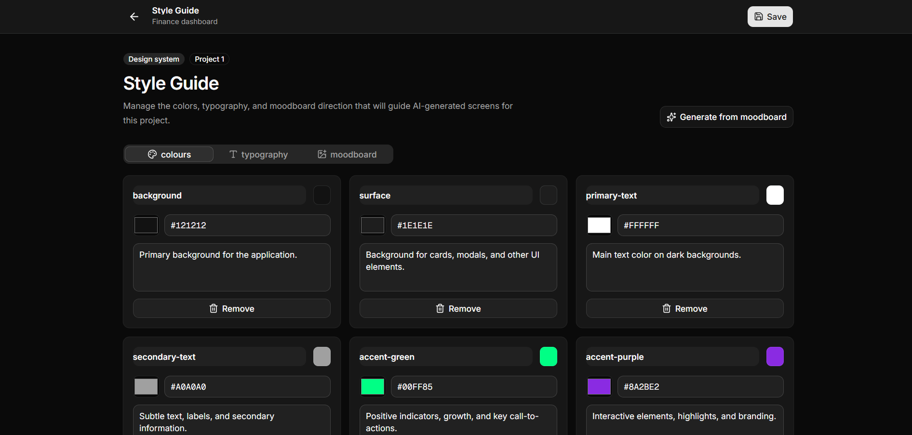

# FramePilot

## Demo Video

> Demo walkthrough video will be added here.

## Screenshots

### Authentication



### Project Dashboard



### Style Guide - Colours



### Style Guide - Typography



### Style Guide - Moodboard



### Workflow Generation



### Sketch to Generated UI



## Description

FramePilot is an AI-assisted sketch-to-design web application built as a full-stack product workflow. It allows users to create design projects, sketch wireframes on an infinite canvas, add moodboard and inspiration images, generate style guides, render AI-powered UI screens, create related workflow pages, and export designs as PNG or JSON.

The project demonstrates the architecture of a modern AI SaaS product, including authentication, protected dashboards, database-backed project management, canvas state handling, background autosave workflows, AI generation APIs, deployment configuration, and production-ready environment setup.

FramePilot was built to explore how visual ideation can move from rough wireframes to structured UI outputs through a guided workflow. The focus is not only on generating screens, but also on understanding the full development pipeline behind an AI product: frontend design systems, backend data models, auth, async jobs, cloud deployment, and AI prompt orchestration.

FramePilot was developed as a full-stack implementation inspired by the Web Prodigies AI SaaS tutorial structure, with custom branding, workflow refinements, deployment setup, and feature adaptations built around the FramePilot product direction.

> Note: This repository is inspired by the Web Prodigies AI SaaS tutorial structure and adapts the concept into the FramePilot product workflow with custom implementation details, branding, and feature decisions.

## Features

- Google authentication with Convex Auth
- Protected dashboard and project routes
- Project creation and management
- Infinite canvas editor
- Frames, rectangles, circles, lines, arrows, text, free drawing, and eraser tools
- Layer selection and editing
- Zoom and pan controls
- Manual save and autosave
- Moodboard uploads and image URL support
- AI-generated color and typography style guides
- AI-generated UI screens from hand-drawn frames
- AI-generated workflow pages from generated UI
- Inspiration board for AI references
- PNG and JSON exports for frames and generated renders
- Dark-mode-only interface
- Responsive dashboard and editor layouts

## Tech Stack

### Frontend

- Next.js App Router
- React
- TypeScript
- Tailwind CSS
- shadcn/ui
- Radix UI
- lucide-react
- Redux Toolkit

### Backend

- Convex
- Convex Auth
- Convex Database
- Convex Storage

### AI

- Gemini API
- Optional OpenAI-compatible fallback structure
- Prompt modules for style guide, UI, and workflow generation

### Automation

- Inngest
- Autosave background workflow

### Development and Deployment

- GitHub
- Vercel
- npm
- VS Code
- ngrok for local webhook/OAuth testing

## Core Workflow

1. The user signs in with Google.
2. The user creates a design project.
3. The user sketches a wireframe on the canvas.
4. The user adds moodboard or inspiration images.
5. FramePilot generates a style guide from the visual references.
6. FramePilot uses the selected frame, style guide, and inspiration board to generate UI.
7. The user can generate related workflow pages from a render.
8. The user can export work as PNG or JSON.

## Project Structure

```txt
app/
  api/                    Next.js API routes for AI, autosave, and Inngest
  dashboard/              Protected dashboard and project routes
  sign-in/                Sign-in route
  sign-up/                Sign-up route

components/
  auth/                   Auth forms
  dashboard/              Dashboard UI
  editor/                 Canvas editor and project workspace
  style-guide/            Style guide and moodboard UI
  ui/                     shadcn/ui primitives

convex/
  auth.ts                 Convex Auth setup
  http.ts                 Convex HTTP routes
  projects.ts             Project queries and mutations
  schema.ts               Database schema

inngest/
  client.ts               Inngest client
  functions.ts            Background workflows

prompts/
  generative.ts           AI generation prompt helpers
  index.ts                Shared prompt definitions

lib/
  permissions.ts          Auth/permission helpers
  use-projects.ts         Project hooks
  utils.ts                Shared utilities
```

## Environment Variables

Create a `.env.local` file for local development. Do not commit real secrets. Use `.env.example` as the reference for required variable names.

Important groups:

- Convex deployment and public URL
- Convex Auth keys
- Google OAuth credentials
- Gemini/OpenAI AI provider credentials
- Inngest signing and event keys

## Local Development

Install dependencies:

```bash
npm install
```

Run the Next.js development server:

```bash
npm run dev
```

Run Convex locally/cloud-dev in a separate terminal:

```bash
npx convex dev
```

Run the Inngest dev server when testing background workflows:

```bash
npm run inngest:dev
```

Open the app:

```txt
http://localhost:3000
```

## Build

Run a production build check:

```bash
npm run build
```

## Deployment Notes

The app can be deployed using:

- Vercel for the Next.js app and API routes
- Convex production deployment for database, auth, functions, and storage
- Inngest for production background jobs
- Google Cloud OAuth for production Google sign-in
- Gemini API for AI generation

When deploying, update provider callback URLs and environment variables for the production domain.

## Security Notes

- Do not commit `.env`, `.env.local`, or any real secret values.
- Do not commit `node_modules`.
- Do not commit `.next`, `.next-build`, logs, or local tunnel files.
- Commit `.env.example` with variable names only.
- Keep production API keys and auth secrets in deployment dashboards only.

## Credit and Disclaimer

This project is inspired by the Web Prodigies AI SaaS tutorial structure. The FramePilot implementation includes custom branding, UI decisions, workflow changes, deployment setup, and feature adaptations built for the FramePilot repository.
